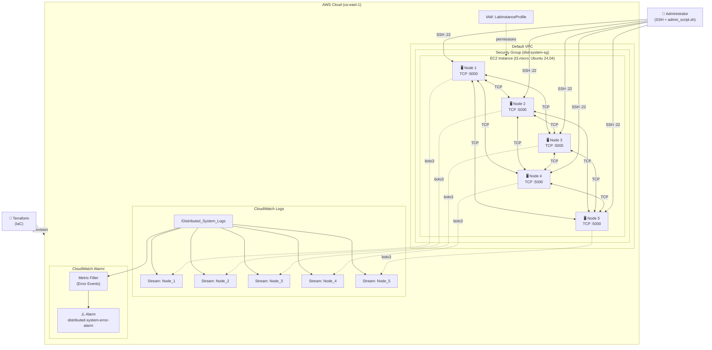
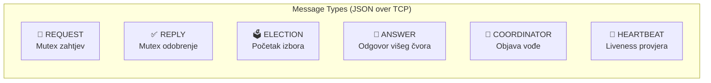
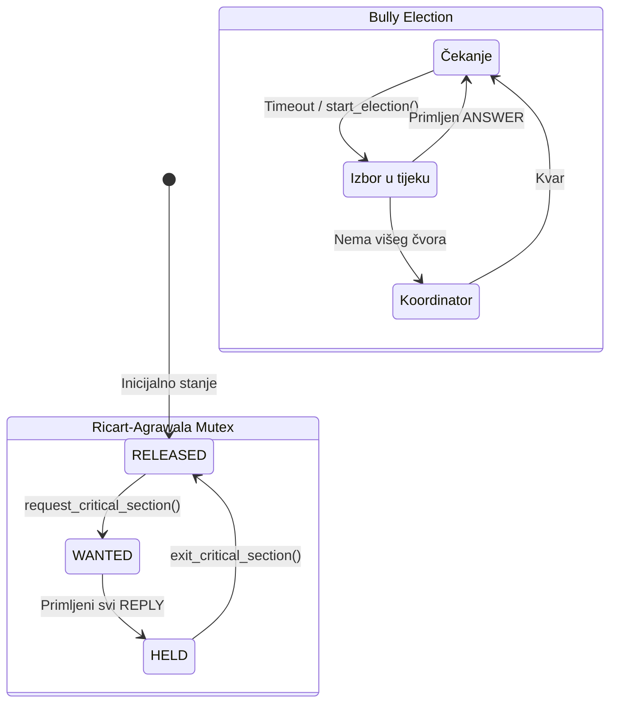
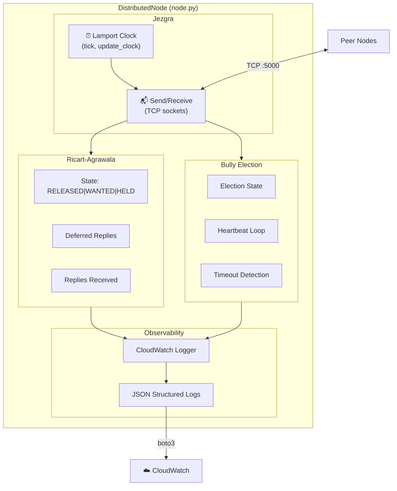
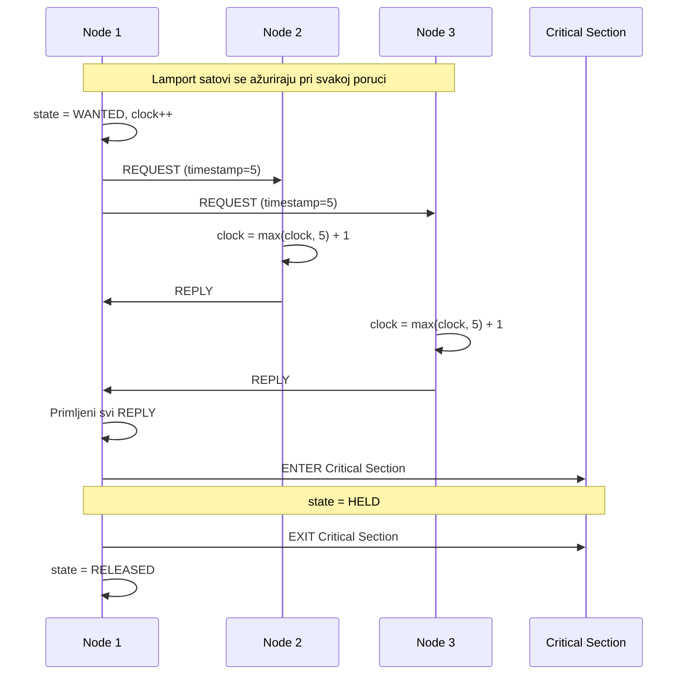
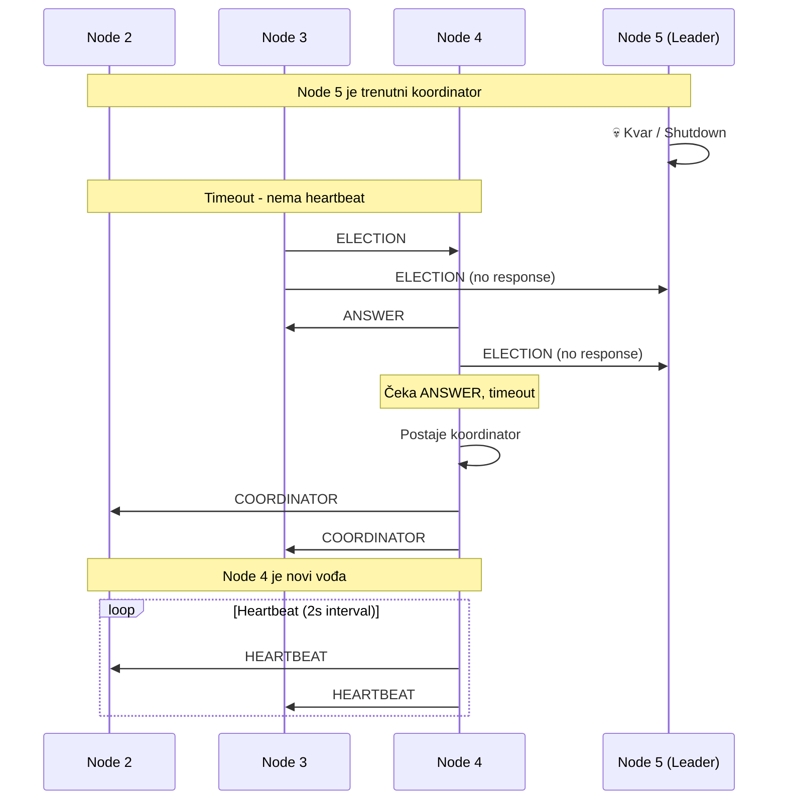

# Arhitekturni dijagram - P2 Distribuirana koordinacija

## Pregled sustava

Ovaj dijagram prikazuje arhitekturu distribuiranog sustava s 5 čvorova koji implementiraju Lamportove logičke satove, Ricart-Agrawala međusobno isključivanje i Bully algoritam za izbor vođe.

## Dijagram infrastrukture

## Dijagram komunikacijskog protokola

## Dijagram algoritama

## Dijagram komponenti čvora

## Dijagram sekvence - Mutex zahtjev

## Dijagram sekvence - Bully Election

## Tagiranje resursa

| Resurs                          | Tag: Project | Tag: Team |
| ------------------------------- | ------------ | --------- |
| EC2 Instance (Node-1 do Node-5) | P2           | T2        |
| CloudWatch Log Group            | P2           | T2        |
| Security Group                  | -            | -         |

## Sigurnosna pravila (Security Group)

| Smjer   | Port | Protokol | Izvor/Odredište   |
| ------- | ---- | -------- | ----------------- |
| Ingress | 22   | TCP      | 0.0.0.0/0 (SSH)   |
| Ingress | 5000 | TCP      | self (inter-node) |
| Egress  | All  | All      | 0.0.0.0/0         |
